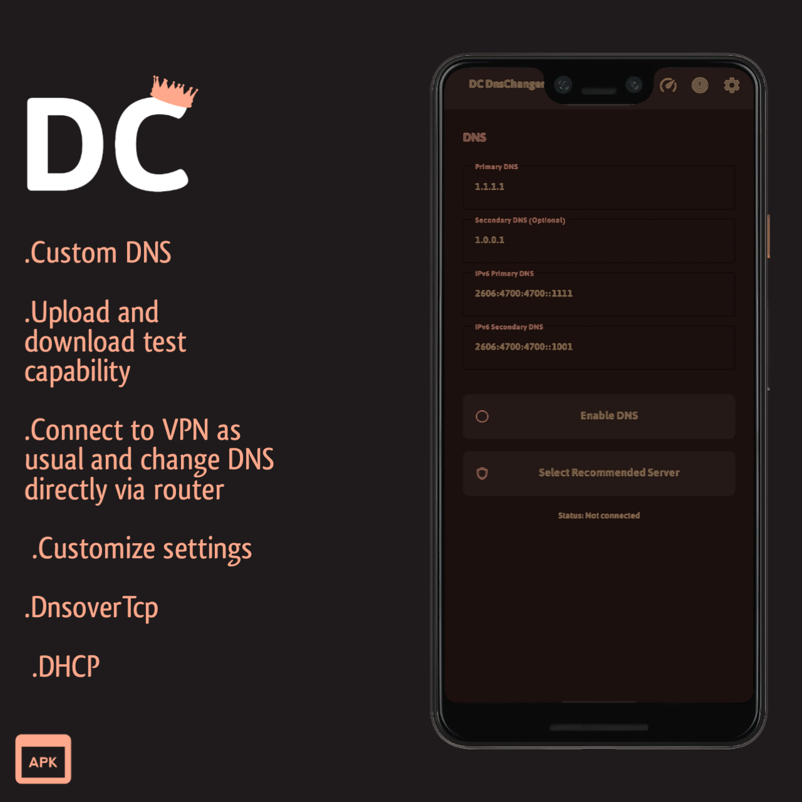

# 💣 Dc Dns Changer
- A high-speed DNS connection!

If you want to get a secure and fast connection from changing DNS, Dc DNS Changer is the best option!




 


# 🧐 Why Dc Dns Changer?

- [x] DHCP
- [x] DNS over TCP
- [x] Speed Test
- [x] Root Mode
- [x] View Logs in Log Viewer
- [x] Import And Export Dns
- [x] Run In Background
- [x] Run In Startup
- [x] Persian And English Language
- [x] Vpn Service
  
## Your links will be shared like this:

```
dnschanger://add?name=PubgDns&dns1=156.154.70.1&dns2=156.154.71.1&ipv6dns1=2620%3A115%3A53%3A%3A53&ipv6dns2=2620%3A115%3A35%3A%3A35
```
